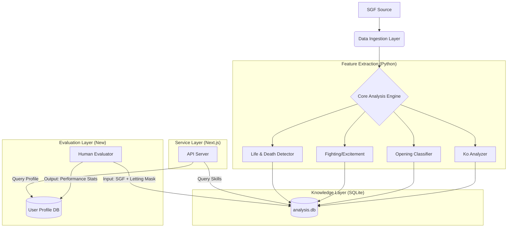

# AI 圍棋教練系統技術規範 (AI Go Coach System Spec)

**版本**: 1.0
**日期**: 2026-01-17
**目標**: 構建一個基於 SGF 數據分析的圍棋教育平台，核心在於區分「AI 讓棋」與「人類實力」，生成精準的棋手畫像。

---

## 1. 系統架構 (Architecture)



---

## 2. 數據庫設計 (Database Schema)

文件: `analysis.db`

### 2.1 基礎分析表
*   **`ko_fights`**: 劫爭記錄 (start_move, end_move, position)
*   **`openings`**: 佈局類型 (Balanced, Punisher, CosmicStyle)
*   **`exciting_games`**: 激戰指標 (lead_changes, score_swing)
*   **`death_spots`**: 局部死活 (move_number, region_rect)
*   **`reversals`**: 逆轉記錄 (low_winrate, reversal_move)

### 2.2 技能標籤表 (`game_skills`)
用於快速檢索某盤棋的特徵。
*   `game_id` (Text)
*   `skill_id` (Text): e.g., 'KO_MASTER', 'ENDGAME_WIZARD'
*   `value` (Real): 權重或計數

### 2.3 人類表現表 (`human_performance`) [待實現]
*   `game_id` (Text)
*   `player_id` (Text)
*   `stability_score` (Real): 穩健度 (0-100)
*   `sharpness_score` (Real): 敏銳度 (0-100)
*   `missed_opportunities` (Int): 錯失大勺子次數
*   `perfect_responses` (Int): 完美應對次數

---

## 3. 核心算法偽代碼 (Core Algorithms)

### 3.1 人類實力評估器 (Human Evaluator)

**輸入**: 
*   `moves`: 對局序列
*   `ai_letting_mask`: AI 讓棋標記 (Map<MoveNum, Severity>)
    *   Severity: `NONE`, `MICRO` (緩手), `BLUNDER` (勺子)

**偽代碼**:

```python
class HumanEvaluator:
    def evaluate_game(self, moves, ai_letting_mask):
        stability_points = 0
        sharpness_points = 0
        
        for move in moves:
            if move.color != HUMAN: continue
            
            # 獲取上一手 AI 的讓棋程度
            ai_severity = ai_letting_mask.get(move.number - 1, NONE)
            
            # 計算人類這一手的目數損失 (相對於最佳手)
            loss = calculate_point_loss(move)
            
            if ai_severity == NONE:
                # 正常對抗：考驗基本功
                if loss < 2.0: stability_points += 1
                elif loss > 5.0: stability_points -= 1
                
            elif ai_severity == MICRO:
                # AI 小讓 (虧 2-5 目)：考驗官子/穩健
                if loss < 1.0: 
                    stability_points += 2 # 獎勵：穩穩接住
                elif loss > 3.0:
                    stability_points -= 2 # 懲罰：送回去
                    
            elif ai_severity == BLUNDER:
                # AI 大勺子 (虧 >15 目)：考驗戰鬥嗅覺
                if loss < 2.0:
                    sharpness_points += 5 # 獎勵：一擊致命
                elif loss > 10.0:
                    sharpness_points -= 5 # 懲罰：視而不見 (盲點)
                    
        return {
            "Stability": normalize(stability_points),
            "Sharpness": normalize(sharpness_points)
        }
```

### 3.2 技能提取器 (Skill Extractor)

已在 `skill_manager.py` 中實現。邏輯匯總：

*   **KO_MASTER**: `count(ko_fights) > 3`
*   **COSMIC_FLOW**: `openings.type == 'CosmicStyle'`
*   **MUD_FIGHTER**: `exciting_games.lead_changes > 10`
*   **DRAGON_SLAYER**: `exciting_games.max_score_gap > 30`
*   **ENDGAME_WIZARD**: `reversals.type == 'Endgame'`

---

## 4. 業務邏輯與應用 (Business Logic)

### 4.1 棋手畫像 (Player Profile)
利用雷達圖展示五維能力：
1.  **Opening (佈局)**: 基於 `PERFECT_OPENING` 命中率。
2.  **Fighting (力量)**: 基於 `Sharpness` 分數 (抓勺能力) + `DRAGON_SLAYER`。
3.  **Endgame (官子)**: 基於 `Stability` 分數 (面對小讓不虧) + `ENDGAME_WIZARD`。
4.  **Resilience (韌性)**: 基於 `reversals` 表中的逆轉勝率。
5.  **Technique (技術)**: 基於 `KO_MASTER` 及特殊手筋題解題率。

### 4.2 智能推薦 (Recommendation)
*   **診斷**: "您的 Sharpness 過低，經常錯過 AI 的大勺子。"
*   **處方**: "推薦做 10 道 `death_spots` 生成的死活題。"
*   **診斷**: "您的 Stability 較差，官子階段經常虧損。"
*   **處方**: "推薦與 AI 進行 `Endgame` 專項訓練（從 200 手開始下）。"

---

## 5. 待辦事項 (Todo)

1.  [ ] **後端集成**: 將 Python 分析腳本封裝為 REST API 或微服務，供 Next.js 調用。
2.  [ ] **讓棋標記**: 需要在 KataGo 引擎端或 SGF 生成端，輸出 `ai_letting_mask` 數據。
3.  [ ] **死活題生成**: 編寫腳本將 `death_spots` 轉換為可交互的 SGF 死活題文件。
